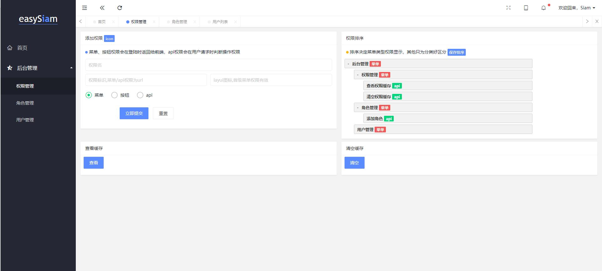

# easyswoole_admin部署教程


v1版本使用mysqli组件+pool

v2版本使用orm组件 建议


下载地址：https://github.com/xuanyanwow/easyswoole_admin/tags

下载源码压缩包 

① 上传源码，并执行 composer install

② es安装  php vendor/easyswoole/easyswoole/bin/easyswoole install  所有提示都输入n 回车

③ 修改dev.php mysql配置  导入mysql结构数据(在public目录下的sql文件)

④ public/nepadmin/config.js搜索 requestUrl  请求url换成你自己的es服务地址  IP:Port

⑤ 访问 IP:Port 自动进入index.html页面

⑥ 管理员账号 1001 123456   测试账号 100083 123456   可以看到测试账号的菜单只有权限管理，点击查看缓存、清除缓存会提示没有权限  （页面权限和接口权限是两回事）

⑦ layui调试模式开关 在public/index.html 
```
// version: Date.parse(new Date()),
debug: false
```

# 作者

Siam - 宣言 - QQ 59419979

可以在easyswoole 1群、2群(管理员)找到俺

# 截图演示




# 权限控制dom
在权限页面有三个按钮
```html

<button class="layui-btn" data-siam-auth="!testtets">没有testtets权限则显示</button>
<button class="layui-btn" data-siam-auth="/api/*">有/api/*权限则显示</button>
<button class="layui-btn" data-siam-auth="/admin/*">有/admin/*权限则显示</button>
```

在dom中使用 data-siam-auth='规则名'  视图显示时候则可自动移除没权限的dom

也可以手动调用验证
```javascript
// 手动调用验证权限
if ( layui.siam.vifAuth('/api/system/clearCache')){
    layer.msg('有/api/system/clearCache的权限');
}else{
    layer.msg('没有/api/system/clearCache的权限');
}
```
